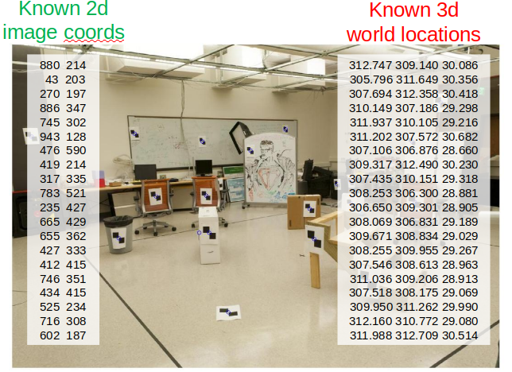
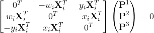

# Camera Initialization

## Basic equations

This section aims to compute the projection matrix that goes from world 3D coordinates to 2D image coordinates. The simplest such correspondence is that between a 3D point $$X$$ **and its image** $$x$$ ****under the unknown camera mapping and thus given sufficiently many correspondences $$X_i \leftrightarrow x_i$$ the camera matrix $$P$$ may be determined.

We assume a number of point correspondences $$X_i \leftrightarrow x_i$$ between 3D points $$X_i$$ and 2D image points $$x_i$$ are given. We are required to find a camera matrix $$P$$, namely a $$3 \times 4$$ matrix such that $$x_i = PX_i$$ for all $$i$$. For each correspondence $$X_i \leftrightarrow x_i$$ we derive a relationship:

Since the three equations above are linearly dependent, one may alternatively choose to use the first two equations.

From a set of $$n$$ point correspondences, we obtain a $$2n \times 12$$ matrix A by stacking up the equations for each correspondence. The projection matrix $$P$$ is computed by solving the set of equations $$\textbf{Ap} = 0$$ where $$\textbf{p}$$ is the vector containing the entries of the matrix $$P$$.

