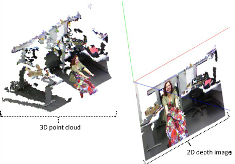

# Texturing



The objective of this step is to texture the generated mesh.

## References

```text
@article{article,
author = {Levy, Bruno and Petitjean, Sylvain and Ray, Nicolas and Maillot, Jérôme},
year = {2002},
month = {07},
pages = {362-371},
title = {Least Squares Conformal Maps for Automatic Texture Atlas Generation},
volume = {21},
journal = {ACM Trans. Graph.},
doi = {10.1145/566654.566590}
}
```

```text
@article{Burt1983AMS,
  title={A multiresolution spline with application to image mosaics},
  author={P. Burt and E. Adelson},
  journal={ACM Trans. Graph.},
  year={1983},
  volume={2},
  pages={217-236}
}
```

```text
@article{article,
author = {Baumberg, Adam},
year = {2003},
month = {01},
pages = {},
title = {Blending Images for Texturing 3D Models},
journal = {Proceedings of the British Machine Vision Conference},
doi = {10.5244/C.16.38}
}
```

```text
@inproceedings{inproceedings,
author = {Allene, Cedric and Pons, Jean-Philippe and Keriven, Renaud},
year = {2009},
month = {01},
pages = {1 - 4},
title = {KERIVEN R.: Seamless image-based texture atlases using multi-band blending},
doi = {10.1109/ICPR.2008.4761913}
}
```

